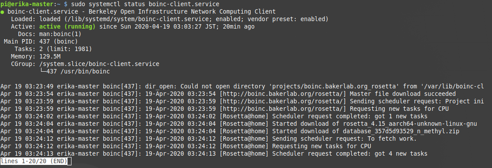

# Raspberry PiでRosetta@homeプロジェクトに参加する
## はじめに
Raspberry Pi 3以降ではCPUに64bitアーキテクチャーを採用しているため64ビットOSを作動させることができますが、オペレーティングシステムとして **Raspbian** を使用した場合、通常、32ビットOSとして作動します。  

今回、**Rosetta@home** に参加するにあたって使用する分散コンピューティングプロジェクトのプラットフォームソフトウェアである **BOINC(Berkeley Open Infrastructure for Network Computing)** は64ビットOS上でしか動作しません。  

まずはじめに、[公式ページ](https://www.raspberrypi.org/forums/viewtopic.php?t=250730)に従ってRaspberry Piを64ビットOSで作動させて下さい。  

また、代替案としてOSに[Ubuntu](https://ubuntu.com/download/raspberry-pi)を使用することもできます。  

&nbsp;


## Rosetta@homeのアカウント作成
次に、[Rosetta@home](http://boinc.bakerlab.org/rosetta/)に参加するためにアカウントを作成します。  
リンクを開き、サインアップを行います。  


必要事項を記入し、アカウント作成を完了させます。  


&nbsp;


## BOINCのインストール
[最初に設定を完了させた](#はじめに)Raspberry Pi上にて下記のコマンドを実行し、BOINCをインストールします。  

```
sudo apt install boinc-client
```

&nbsp;


次に、BOINCを稼働させるために設定を行います。  
**"/var/lib/boinc-client/cc_config.xml"** ファイルを開き、下記の内容を反映させます。  


```
<cc_config>
  <log_flags>
    <task>1</task>
    <file_xfer>1</file_xfer>
    <sched_ops>1</sched_ops>
  </log_flags>
  <options>
    <alt_platform>aarch64-unknown-linux-gnu</alt_platform>
  </options>
</cc_config>
```

&nbsp;


設定ファイルの内容を反映させるために、下記のコマンドを実行します。  

```
boinccmd --read_cc_config
```

&nbsp;


## Rosetta@homeへの参加
それでは、Raspberry PiをRosetta@homeに参加させていきます。  
[Rosetta@homeのアカウント作成](#Rosetta@homeのアカウント作成)にて作成したアカウント情報をもとに下記のコマンドを実行して下さい。  

```
boinccmd --lookup_account http://boinc.bakerlab.org/rosetta/ <your_email> <your_password>
```

&nbsp;


実行が終了すると、下記のようなメッセージが現れます。  

```
status: Success
poll status: operation in progress
poll status: operation in progress
account key: xxxxxxxxxxxxxxxxxxxxxxxxxxxxxxxx
```

&nbsp;

上記で得られた **"account key"** の内容を引数として下記のコマンドを実行し、Rosetta@homeへの参加を完了させます。  

```
boinccmd --project_attach http://boinc.bakerlab.org/rosetta/ <your_account_key>
```

&nbsp;


Rosetta@homeへ参加できているか確認します。  
**数分待ってから**、下記のコマンドを実行して下さい。  

```
boinccmd --get_state
```

&nbsp;


参加できている場合、下記のようなメッセージが現れます。  


&nbsp;


## 動作確認
下記のコマンドを実行し、BOINCが動作しているか確認してみます。  

```
sudo systemctl status boinc-client.service
```

&nbsp;


下記の内容から動作に必要なデータやファイルをダウンロードし、合計5つのタスクを要求していることがわかります。  



&nbsp;


タスクの実行が始まるまでしばらく待ってから、下記のコマンドを実行します。  

```
sudo systemctl status boinc-client.service
```

&nbsp;


下記の内容からタスクの実行が始まっていることがわかります。  


&nbsp;


下記のコマンドを実行し、タスクの詳細を確認してみます。  

```
boinccmd --get_tasks
```

&nbsp;


実行結果より、一つのタスクが実行中であることが確認できました。  


&nbsp;


## 最後に
**一つのタスクが完了するまでおおよそ7時間30分かかりました。**  


&nbsp;


なお、Rosetta@homeのアカウントページの **"Preferences for this project"** から **"Rosetta@home preferences"** というリンクに飛び、**"Target CPU run time"** を変更することでタスクの完了にかかる時間を調整することができます。  

&nbsp;


## 参考文献
- [Raspberry Pi BOINC Tutorial, PiMyLifeUp](https://pimylifeup.com/raspberry-pi-boinc/)
- [Do something useful with your Pi4, Marks Rpi Cluster](http://marksrpicluster.blogspot.com/2020/04/do-something-useful-with-your-pi4.html?m=1)
- [Rosetta@home on Raspbian Pi 4, Gam3t3ch Electronics Hobby House Blog](https://www.element14.com/community/people/gam3t3ch/blog/2020/04/09/rosettahome-on-raspbian-pi-4)
